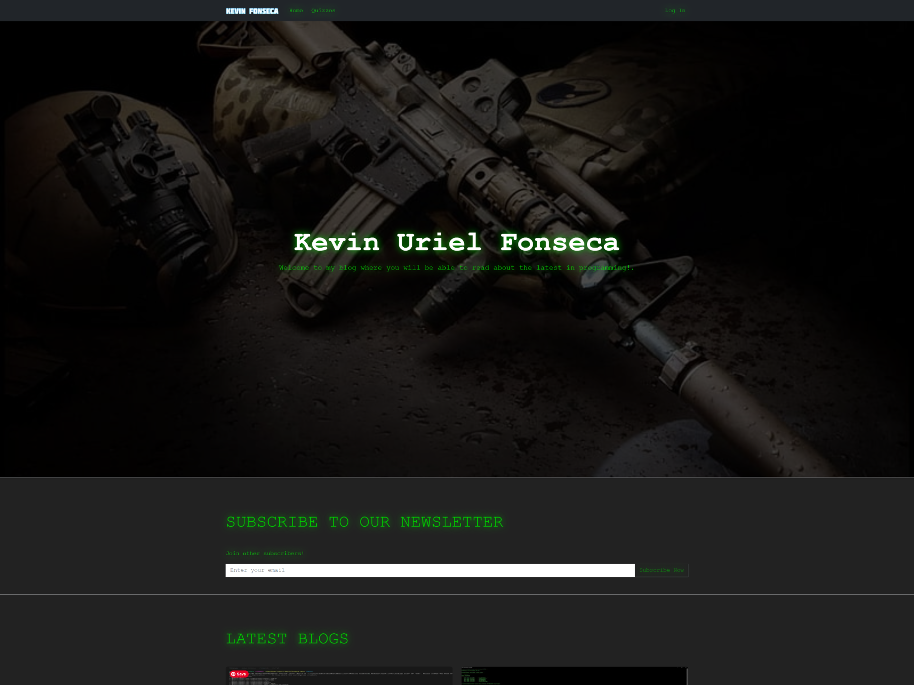

# Welcome to Kevin's Web



This is a [Kevin's Web](https://kevinurielfonseca.me/) project bootstrapped with [`create-next-app`](https://github.com/vercel/next.js/tree/canary/packages/create-next-app).

## Getting Started

- Visit our [Learn Next.js](https://nextjs.org/learn) course to get started with Next.js.
- Visit the [Next.js Showcase](https://nextjs.org/showcase) to see more sites built with Next.js.

## Documentation

Visit [https://kevinurielfonseca.me/docs](https://kevinurielfonseca.me/docs) to view the full documentation.

## Community

The Kevin's Web community can be found on [GitHub Discussions](https://github.com/kirasiris/kevinurielfonsecav4/discussions) where you can ask questions, voice ideas, and share your projects with other people.

To chat with other community members you can join the Next.js [Discord](https://kevinurielfonseca.me/discord) server.

Do note that our [Code of Conduct](https://github.com/kirasiris/kvinurielfonsecav4/blob/main/CODE_OF_CONDUCT.md) applies to all Next.js community channels. Users are **highly encouraged** to read and adhere to them to avoid repercussions.

## Contributing

Contributions to Next.js are welcome and highly appreciated. However, before you jump right into it, we would like you to review our [Contribution Guidelines](/contributing.md) to make sure you have a smooth experience contributing to Kevin's Web.

### Good First Issues

We have a list of **[good first issues](https://github.com/kirasiris/kevinurielfonsecav4/labels/good%20first%20issue)** that contain bugs that have a relatively limited scope. This is a great place for newcomers and beginners alike to get started, gain experience, and get familiar with our contribution process.

## Kevin's Web Author

- Kevin Fonseca ([@kirasiris](https://github.com/kirasiris))

## Kevin's Web Authors

A list of the original co-authors of Kevin's Web that helped bring this amazing website to life!

- Kevin Fonseca ([@kirasiris](https://github.com/kirasiris))

---

## Security

If you believe you have found a security vulnerability in Kevin's Web, I encourage you to **_responsibly disclose this and NOT open a public issue_**.

I will investigate all legitimate reports. and do my best to quickly fix the problem.

Email `kebin1421@hotmail.com` to disclose any security vulnerabilities.

Alternatively, you can visit this [link](https://kevinurielfonseca.me/security) to know more about Kevin's Web security

---

## Standards for inputs and forms based on onSubmit={} or action={} attributes

### Client form inputs using onSubmit={}

```jsx
import { useState } from 'react';

const [formData, setFormData] = useState({
    exampleValue = ``,
})

const [btnText, setBtnText] = useState("Submit");
const { exampleValue } = formData;

const submitForm = async (e) => {
    e.preventDefault();
    setBtnText("Processing...");
    const res = await fetchurl(`/API_ROUTE`, "METHOD", "no-cache", {
        ...formData,
        // otherFields; examples:
        // secondaryValueNotControlledByUserOrForm: 'yada=yada'
    });
    if(res.status === "error") {
        toast.error(res.message, "bottom");
        setBtnText("Submit");
        return; // Stop propagation
    }
    setBtnText("Submit");
    toast.success("Data sent", "bottom");
    resetForm();
    router.push(`/PAGE_TO_REDIRECT_TO`);
}

const resetForm = () => {
    setFormData({
        exampleValue = ``,
    })
}

return (
    <form onSubmit={submitForm}>
        <label htmlFor="exampleId" className="form-label" />
        <input
            id="exampleId"
            name="exampleName"
            value={exampleValue}
            onChange={(e) => {
                setFormData({
                    ...formData,
                    exampleValue: e.target.value
                })
            }}
            type="text"
            className="mb-3"
            required
            placeholder=""
        />
        <button
            type="submit"
            className="">
                {btnText}
        </button>
        <button
            type="reset"
            onClick={resetForm}
            className=""
        >
            Reset
        </button>        
    </form>
)
```

### Client form inputs  using action={}

```jsx
import FormButtons from "/PATH_TO_FormButtons_COMPONENT"

const submitForm = async (formData) => {
    "use server"

    const formData = {
        exampleValue: formData.get("exampleName"),
    }

    const res = await fetchurl(`/API_ROUTE`, "METHOD", "no-cache", {
        ...formData,
        // otherFields; examples:
        // secondaryValueNotControlledByUserOrForm: 'yada=yada'
    });
    revalidatePath(`/PAGE_TO_REDIRECT_TO`);
    // OR
    revalidateTags(`/PAGE_TO_REDIRECT_TO`);
}

return (
    <form action={submitForm}>
        <label htmlFor="exampleId" className="form-label" />
        <input
            id="exampleId"
            name="exampleName"
            defaultValue="WHATEVER"
            type="text"
            className="mb-3"
            required
            placeholder=""
        />
        <FormButtons />
    </form>
)

// FormButtons.js COMPONENTs
"use client"

import { useFormStatus } from "react";

const FormButtons = ({ }) => {
    const { pending } = useFormStatus();
    
    return (
        <>
            <button
                type="submit"
                className=""
                aria-disabled={pending}
                disabled={pending}
            >
                {pending ? "Processing..." : "Submit"}
            </button>
            <button
                type="reset"
                className=""
            >
                Reset
            </button>
        </>
    );
}

export default FormButtons;
```

Fully custom server action form without the use of "use client"

```js
import { z } from 'zod'
import { redirect } from 'next/navigation'

const loginSchema = z.object({
  email: z.string().email({ message: 'Invalid email format' }),
  password: z.string().min(6, { message: 'Password must be at least 6 characters' }),
  rememberMe: z.union([z.string(), z.null()]).transform(val => val === 'on'),
})

async function loginAccount(formData) {
  'use server'

  const rawFormData = {
    email: formData.get('email'),
    password: formData.get('password'),
    rememberMe: formData.get('rememberMe'),
  }

  const parsed = loginSchema.safeParse(rawFormData)

  if (!parsed.success) {
    return { error: parsed.error.format() }
  }

  const validData = parsed.data

  // Simulate API call (replace with actual request)
  const success = validData.email === 'test@example.com' && validData.password === 'password123'

  if (!success) {
    return { error: { general: ['Login failed. Please check your credentials.'] } }
  }

  // On success, redirect to a new page
  redirect('/dashboard')
}

export default function LoginForm({ searchParams }) {
  return (
    <form action={loginAccount} method="post" onSubmit="handleSubmit(event)">
      <input type="email" name="email" placeholder="Email" required />
      {searchParams?.error?.email && <p style={{ color: 'red' }}>{searchParams.error.email}</p>}

      <input type="password" name="password" placeholder="Password" required />
      {searchParams?.error?.password && <p style={{ color: 'red' }}>{searchParams.error.password}</p>}

      {searchParams?.error?.general && <p style={{ color: 'red' }}>{searchParams.error.general}</p>}

      <button type="submit" id="loginButton">Login</button>
      <button type="reset" id="resetButton">Reset</button>

      {/* Inline Script to Handle Button State */}
      <script dangerouslySetInnerHTML={{
        __html: `
          function handleSubmit(event) {
            const button = document.getElementById('loginButton');
            button.innerText = 'Processing...';
            button.disabled = true;
          }

          document.getElementById('resetButton').addEventListener('click', () => {
            const button = document.getElementById('loginButton');
            button.innerText = 'Login';
            button.disabled = false;
          });
        `
      }} />
    </form>
  )
}
```